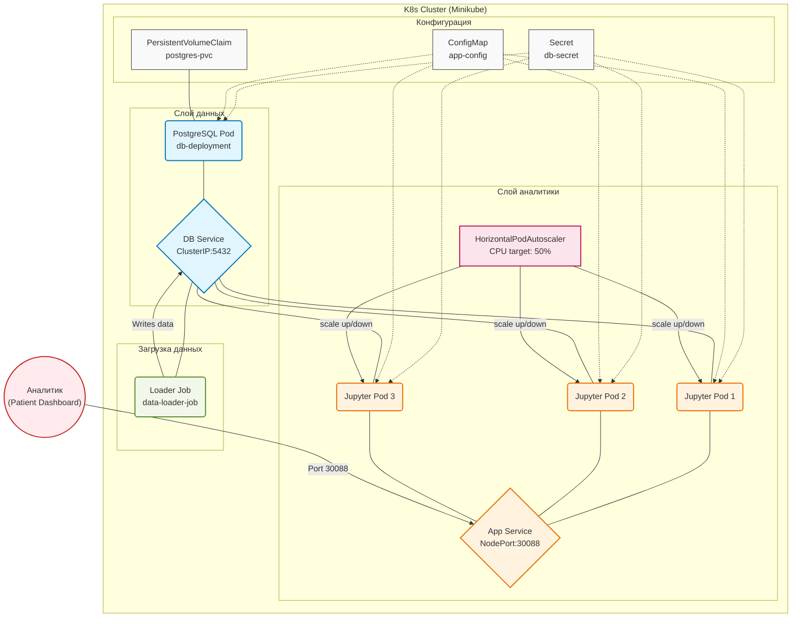

# Лабораторная работа 3. Развертывание простого приложения в Kubernetes.

**Выполнил:** Трухачев Никита Алексеевич 

**Группа:** БД251-м

**Вариант:** 30 (Здравоохранение / Patient Dashboard)  

**Техническое задание (K8s Specific):** Реализовать HPA (Horizontal Pod Autoscaler) манифест (CPU target 50%).

---

## 1. Цель работы
Получить практические навыки оркестрации контейнеризированных приложений в среде Kubernetes. Выполнить миграцию архитектуры из Docker Compose в K8s, настроить управление конфигурациями (ConfigMaps/Secrets), обеспечить персистентность данных (PVC), настроить проверки жизнеспособности (Probes) и реализовать горизонтальное автомасштабирование (HPA).

---

## 2. Технический стек и окружение
- **ОС:** Ubuntu 24.04 LTS
- **Контейнеризация:** Docker
- **Оркестрация:** Minikube (Driver: Docker), Kubernetes (kubectl)
- **База данных:** PostgreSQL 15 (Alpine)
- **Аналитическая среда:** Jupyter Notebook (scipy-notebook)
- **Библиотеки:** `psycopg2-binary`, `pandas`, `seaborn`, `matplotlib`, `sqlalchemy`

---

## 3. Архитектура решения


## 4. Выполнение работы

### Этап 1. Подготовка кластера и образов

#### Запуск Minikube
```bash
minikube start --driver=docker
minikube status
```


#### Настройка окружения
```bash
eval $(minikube docker-env)
kubectl get nodes
```

#### Включение metrics-server для HPA
```bash
minikube addons enable metrics-server
kubectl get pods -n kube-system | grep metrics-server
```


#### Исходный код Docker-образов (Локальная сборка)


#### Сборка Docker-образов
```bash
docker build -t healthcare-app:v1 ./app
docker build -t healthcare-loader:v1 ./loader
```


### Этап 2. Управление конфигурацией и данными
#### Создание манифестов
**01-config.yaml (Secret + ConfigMap + PVC)**


**02-db.yaml (Deployment + Service для БД)**


**03-app.yaml (Deployment для приложения)**


**04-service.yaml (Service для приложения)**


**05-hpa.yaml (HPA - специфика варианта 30)**


**06-job.yaml (Job для загрузки данных)**


#### Применение манифестов
```bash
kubectl apply -f 01-config.yaml
kubectl apply -f 02-db.yaml
kubectl apply -f 03-app.yaml
kubectl apply -f 04-service.yaml
kubectl apply -f 05-hpa.yaml
kubectl apply -f 06-job.yaml
```
### Этап 3. Проверка работы компонентов
#### Доступ к приложению (Jupyter)

```bash
minikube service app-service --url
kubectl logs deployment/app-deployment | grep token
```


#### Выполнение аналитики в Jupyter


#### Результаты аналитики


## 4. Выводы
В ходе выполнения лабораторной работы были получены практические навыки оркестрации контейнеризированных приложений в среде Kubernetes. Выполнена миграция архитектуры из Docker Compose в K8s с реализацией следующих компонентов:
- Управление конфигурацией: Secret для хранения паролей (base64), ConfigMap для несекретных настроек
- Персистентное хранение: PVC для базы данных с подтверждением сохранности данных
- Жизненный цикл: InitContainer для проверки доступности БД, Liveness и Readiness Probes
- Специфика варианта 30: HorizontalPodAutoscaler с целевой загрузкой CPU 50%
- Загрузка данных: Job, который успешно загрузил 1000 тестовых записей
- Аналитика: Jupyter Notebook с визуализацией данных пациентов
Все компоненты успешно развернуты и функционируют в кластере Minikube.

