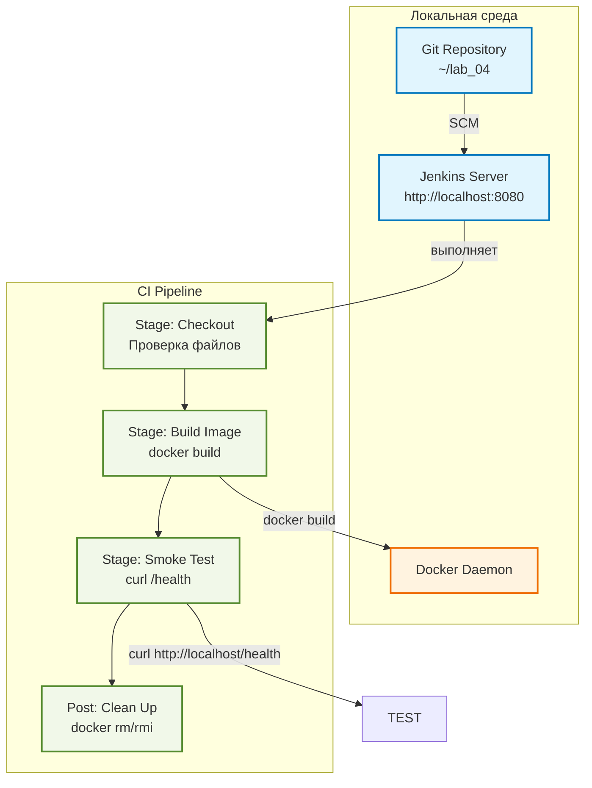

# Лабораторная работа 4. Автоматизация ETL-скрипта с помощью CI/CD.

**Выполнил:** Трухачев Никита Алексеевич 

**Группа:** БД251-м

**Вариант:** 30 (Здравоохранение)  
**Техническое задание:** 	Запустить контейнер, сделать curl localhost:port/health. Если 200 OK — успех.

---

## 1. Цель работы
Настроить автоматический конвейер (Pipeline) непрерывной интеграции для ETL-компонента. Научиться обеспечивать качество кода и автоматическую сборку Docker-образов при каждом изменении в репозитории с помощью Jenkins.

---

## 2. Технический стек и окружение
- **ОС:** Ubuntu 24.04 LTS
- **Контейнеризация:** Docker
- **CI/CD инструмент:** Jenkins (запущенный в Docker)
- **Язык:** Python 3.10
- **Тестирование:** Smoke Test (health check)

---

## 3. Архитектура решения

## 4. Выполнение работы

### 4.1 Запуск Jenkins в Docker
Для развертывания CI/CD сервера был использован Jenkins в контейнере Docker.
Создан файл docker-compose.yml с пробросом Docker-сокета хоста, что позволяет Jenkins выполнять команды Docker изнутри контейнера. 
После запуска контейнера был получен первичный пароль администратора, установлены рекомендованные плагины и создан учетная запись администратора. 
Jenkins стал доступен по адресу http://localhost:8080.

**Создание docker-compose.yml:**

**Запуск Jenkins и получение пароля администратора:**

### 4.2 Структура Git-репозитория
В локальном репозитории ~/lab_04 размещены файлы проекта: ETL-скрипт (etl.py), HTTP-сервер с эндпоинтом /health (health_server.py), 
инструкция для сборки Docker-образа (Dockerfile), зависимости Python (requirements.txt) и основной файл пайплайна (Jenkinsfile).
Все файлы были добавлены в Git и закоммичены.

**Создание проекта:**

**Файлы проекта:**

etl.py - ETL-скрипт обработки данных пациентов

health_server.py - HTTP-сервер с эндпоинтом /health

Dockerfile - Инструкция для сборки образа

Jenkinsfile - Описание CI/CD пайплайна

### 4.3 Jenkinsfile (Pipeline Script)
Файл Jenkinsfile описывает Declarative Pipeline, состоящий из трех основных стадий: проверка файлов в workspace, 
сборка Docker-образа с тегом healthcare-etl:${BUILD_NUMBER} и smoke test с проверкой доступности эндпоинта /health. 
В блоке post реализована обязательная очистка ресурсов (остановка и удаление контейнера, удаление образа) после завершения пайплайна независимо от результата.

### 4.4 Создание Jenkins Job
В веб-интерфейсе Jenkins была создана задача (Job) типа Pipeline с именем healthcare-etl-pipeline. 
В настройках задачи выбран тип "Pipeline script", в поле Script вставлено содержимое Jenkinsfile. 
После сохранения конфигурации Job стала доступна для ручного запуска через интерфейс Jenkins.
**Параметры Job:**
- Имя: healthcare-etl-pipeline
- Тип: Pipeline
- Definition: Pipeline script (вставлен код из 4.3)

### 4.5 Демонстрация Quality Gate (Smoke Test)
Для демонстрации работы Quality Gate были выполнены два запуска пайплайна. 
Первый — успешный, при котором контейнер был запущен, эндпоинт /health вернул ожидаемый ответ "healthy", и пайплайн завершился с зеленым статусом. 
Второй — провальный, при котором проверка выполнялась на несуществующий эндпоинт /health_bad, что привело к ошибке и красному статусу сборки. 
Это подтверждает корректную работу smoke test как Quality Gate.

#### 4.5.1 Успешный запуск
Пайплайн выполнил все стадии, smoke test прошел успешно.

Согласно техническому заданию варианта 30, в качестве Quality Gate был реализован Smoke Test — проверка работоспособности контейнера после сборки.

**Алгоритм проверки:**
1. Запуск контейнера в фоновом режиме: docker run -d --name health-test -p 8083:80 healthcare-etl:${BUILD_NUMBER}
2. Ожидание старта сервиса: sleep 3
3. Выполнение HTTP-запроса к эндпоинту /health: curl -s http://localhost/health
4. Проверка ответа: если в ответе содержится строка "healthy" (что соответствует HTTP 200 OK), тест считается пройденным

**Результаты проверки:**
- Успешный запуск (сборка №12): эндпоинт /health доступен, контейнер отвечает статусом 200 OK, пайплайн завершается с зеленым статусом

#### 4.5.2 Провальный запуск (демонстрация Quality Gate)
Для демонстрации работы Quality Gate был изменен эндпоинт с /health на /health_bad. Пайплайн упал на стадии Smoke Test.
Изменение пайплайна:

Вывод ошибки в консоли: 

**Результаты проверки:**
- Провальный запуск (сборка №13): эндпоинт /health_bad не существует, проверка завершается с ошибкой, пайплайн падает

### 4.6 Сборка Docker-образа
В процессе выполнения пайплайна на стадии Build Docker Image был собран Docker-образ на основе официального образа nginx:alpine. 
В образ был добавлен файл /health с содержимым {"status":"healthy"}. 
После успешной сборки образ с тегом healthcare-etl:${BUILD_NUMBER} отображался в списке локальных Docker-образов, что подтверждает корректность конфигурации сборки.

**Лог сборки:**

**Образ виден в системе**

## 6. Выводы
В ходе выполнения лабораторной работы был настроен автоматический конвейер CI/CD с использованием Jenkins в Docker. Реализованы следующие компоненты:
1. Jenkins сервер — запущен локально, доступен через веб-интерфейс
2. Pipeline — содержит 3 стадии:
  - Проверка файлов в workspace
  - Сборка Docker-образа
  - Smoke Test (health check)
3. Quality Gate — проверка /health эндпоинта; при недоступности пайплайн завершается с ошибкой
4. Очистка ресурсов — после каждого запуска контейнеры и образы удаляются
